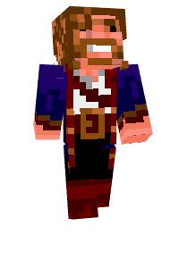

# &lt;mc-skinpreview&gt;

> A web component to preview Minecraft skins.

The model loader was originally written by @daniel_hede and is now stripped down to the basics of displaying skins. Works now with Three.js r66 (Kudos to @deathcap for fixing the uv maps). 

```html
<mc-skinpreview username="Notch"></mc-skinpreview>
```



## Usage
**&lt;mc-skinpreview&gt;** is a web component built with polymer that displays minecraft skins and can be easily included into websites. 

1. Import Polymer
  ```html
  <script src="bower_components/platform/platform.js"></script>
  ```

2. Import mc-skinpreview
  ```html
  <link rel="import" href="bower_components/mc-skinpreview/dist/mc-skinpreview.html">
  ```

3. Enjoy beautiful Minecraft avatars
  ```html
 <mc-skinpreview src="skin.png"></mc-skinpreview>
  ```


## Options

### src

Sets the source of the skin. Currently only 64x32 pixels are supported.

```html
<mc-skinpreview src="skin.png"></mc-skinpreview>
```

### username

Just like `src` but retrieves the skin from an external skin server. 
This is actually a shorthand for `src="http://minecraftskins.herokuapp.com/skin/<username>.png"`. Defaults to `Notch`.

```html
<mc-skinpreview username="Notch"></mc-skinpreview>
```

### width

Sets the width (in pixels) of the canvas the skin is painted on. Defaults to `100`.

```html
<mc-skinpreview username="Notch" width="200"></mc-skinpreview>
```

### height

Sets the height (in pixels) of the canvas the skin is painted on. Defaults to `200`.

```html
<mc-skinpreview username="Notch" height="300"></mc-skinpreview>
```

### rotate

Toggles rotation of the avatar. Defaults to `false`.

```html
<mc-skinpreview username="Notch" rotate></mc-skinpreview>
```

### paused

Pauses the animation of the avatar. Defaults to `false`.

```html
<mc-skinpreview username="Notch" paused></mc-skinpreview>
```

### running

Toggles a run animation. Defaults to `false`.

```html
<mc-skinpreview username="Notch" running></mc-skinpreview>
```

## Contributing

1. Fork it!
2. Create your feature branch: git checkout -b my-new-feature
3. Commit your changes: git commit -m 'Add some feature'
4. Push to the branch: git push origin my-new-feature
5. Submit a pull request =)

## License
BSD


"Minecraft" is a trademark of Notch Development AB 